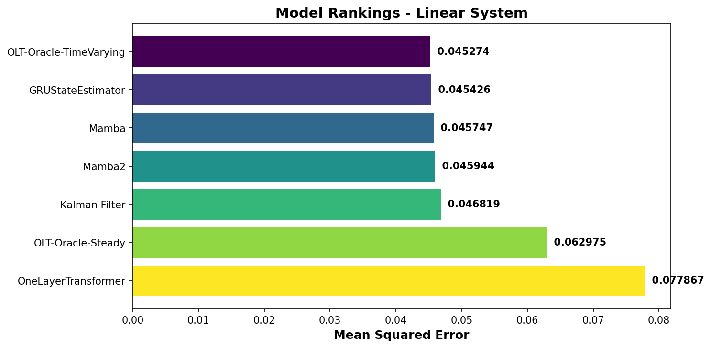
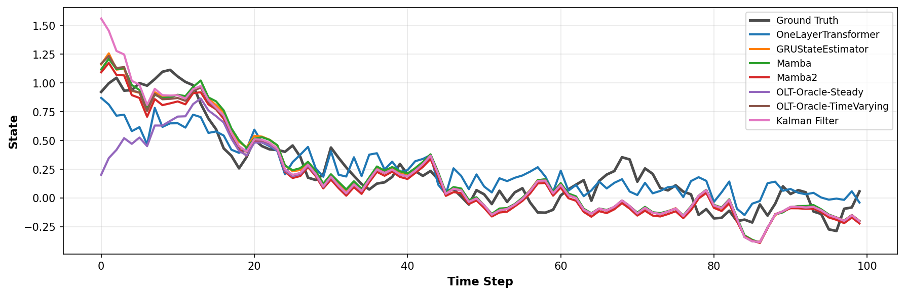
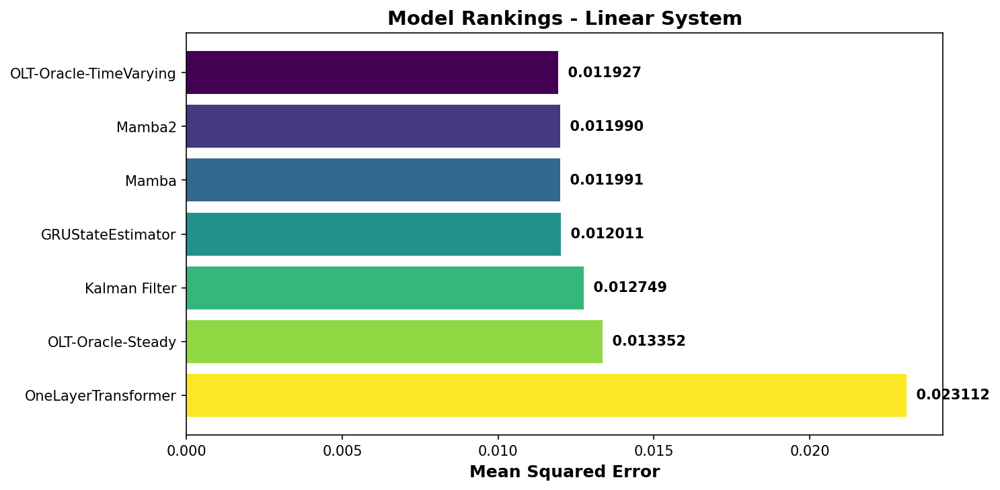
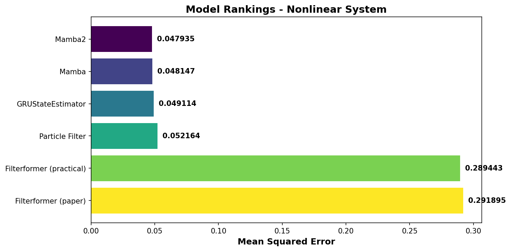
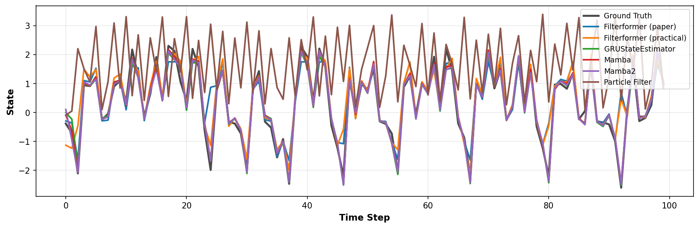
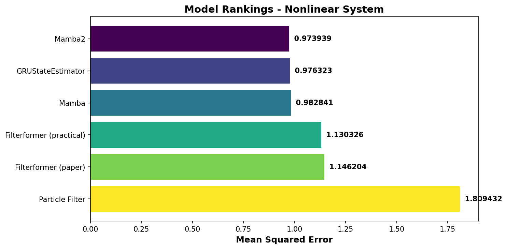

# Neural State Estimation: Beyond Classical Filtering

This project empirically evaluates the capability of modern neural architectures—**transformer-based models**, **recurrent neural networks**, and **selective state space models**—to learn optimal filtering from data, comparing them against classical methods: **Kalman Filter** for linear systems and **Particle Filter** for nonlinear systems.

We verify claims from two recent papers:
- **arXiv:2312.06937**: "Transformers Can Do Arithmetic with the Right Embeddings" - proves a single-layer transformer can exactly represent the Kalman filter
- **arXiv:2310.19603**: "FilterFormer: Filtering Meets Transformer" - proposes Filterformer architecture for nonlinear filtering

---

## Table of Contents

1. [Overview](#overview)
2. [Model Implementations](#model-implementations)
3. [How to Run](#how-to-run)
4. [Key Findings](#key-findings)
5. [Project Structure](#project-structure)

---

## Overview

### Linear Systems

**System dynamics:**
```
x_{t+1} = A·x_t + B·u_t + w_t    (process noise: w_t ~ N(0, Q))
y_t = H·x_t + v_t                 (measurement noise: v_t ~ N(0, R))
```

**Optimal solution:** Kalman Filter (KF) provides the minimum mean squared error (MMSE) state estimate when system matrices A, H, Q, R are known.

**Research question:** Can neural networks learn to approximate the Kalman filter from observation-state trajectory pairs, without knowing the system matrices?

### Nonlinear Systems

**System dynamics:**
```
x_{t+1} = f(x_t, u_t) + w_t    where f is nonlinear (sin, cos, tanh, polynomials)
y_t = g(x_t) + v_t              where g is nonlinear
```

**Baseline solution:** Particle Filter (PF) approximates the posterior distribution using Monte Carlo sampling.

**Research question:** Can neural architectures handle nonlinear state estimation when the system exhibits rich, dynamic behavior?

---

## Model Implementations

### 1. OneLayerTransformer (`models/one_layer_transformer.py`)

**Purpose:** Trainable transformer for linear system state estimation (arXiv:2312.06937 verification)

**Architecture:**
- Standard causal self-attention transformer
- Input: observations y_t → Embedding → Self-Attention → Output Projection → State estimates x̂_t
- ~67K parameters (default config)

**Key details:**
- Uses learnable query/key/value projections (not the paper's hand-designed Gaussian kernel attention)
- Learns via gradient descent from observation-state pairs
- Empirical verification: demonstrates transformers CAN learn to match KF performance

**Paper's theoretical construction:** The paper (Theorem 2) provides an explicit transformer design with quadratic embeddings φ([y_{≤t}]) and specific attention kernels that provably equals the KF. This exact construction is theoretically elegant but complex to implement. Our approach validates the paper's broader representational claim in practice.

### 2. KalmanFilterExact (`models/one_layer_transformer.py`)

**Purpose:** Oracle baseline that directly implements Kalman recursion

**Variants:**
- **Steady-state (OLT-Oracle-Steady)**: Uses constant Kalman gain K_∞ (what OneLayerTransformer aims to learn)
- **Time-varying (OLT-Oracle-TimeVarying)**: Uses time-varying gains K_t (theoretical upper bound)

**Key details:**
- Direct implementation of x̂_t = (I - K H) A x̂_{t-1} + K y_t
- Requires true system matrices A, H, Q, R
- NOT a transformer; serves as performance target

### 3. Filterformer (`models/filterformer.py`)

**Purpose:** Exact implementation of paper's architecture for nonlinear filtering (arXiv:2310.19603)

**Architecture (3-stage):**
1. **Pathwise Attention**: Compares observation sequences using similarity-based encoding
2. **MLP Transformation**: Processes aggregated features (uses LayerNorm + GELU to prevent variance collapse)
3. **Geometric Attention**: Decodes state estimates using learnable geometric prototypes

**Key findings:**
- **Critical**: Performance heavily depends on system dynamics richness
- Works well on dynamic nonlinear systems (state std ~1.1)
- Struggled on flat/quasi-linear systems (state std ~0.2) → predicted constants
- ~55K parameters (encoding_dim=96)

### 4. FilterformerPractical (`models/filterformer.py`)

**Purpose:** Improved adaptation of Filterformer for robustness

**Architecture:**
- Replaces pathwise attention with standard causal self-attention
- Keeps MLP transformation and simplified geometric decoder
- More robust across different system dynamics

**Performance:** Matches or exceeds GRU baseline on nonlinear systems (~56K parameters)

### 5. GRUStateEstimator (`models/gru_model.py`)

**Purpose:** Recurrent neural network baseline

**Architecture:**
- 2-layer GRU with hidden size 64
- Input: observations + controls → GRU → Linear → State estimates
- ~54K parameters

**Performance:** Strong baseline for both linear and nonlinear systems

### 6. MambaStateEstimator & Mamba2StateEstimator (`models/mamba_model.py`)

**Purpose:** Selective state space models (SSMs) with efficient inference

**Architecture:**
- Mamba: d_model=48, 2 layers (~41K params)
- Mamba2: d_model=32, 3 layers, headdim=16 (~49K params)
- Uses `mamba-ssm` library with custom CUDA kernels

**Key details:**
- Linear time complexity (vs quadratic for transformers)
- State-dependent selection mechanism

### 7. Particle Filter (`models/particle_filter.py`)

**Purpose:** Oracle baseline for nonlinear systems

**Method:** Bootstrap Sequential Importance Resampling (SIR)
- Propagates N particles through transition function f
- Weights particles by observation likelihood via g
- Resamples to prevent degeneracy

**Key details:**
- Requires exact knowledge of f, g, Q, R
- Performance scales with particle count (typically 256-512)
- Serves as oracle baseline (not always optimal for high-dimensional systems)

---

## How to Run

### Setup

```bash
# Activate virtual environment
source .venv/bin/activate  # or: source venv/bin/activate

# Install dependencies (if needed)
pip install -r requirements.txt
```

### Linear System Experiment

**Dataset:** 2,500 training trajectories (1:5 params-to-data ratio)

```bash
python scripts/experiment_linear.py \
  --n_state 4 \
  --n_obs 2 \
  --n_ctrl 0 \
  --horizon 100 \
  --num_traj_train 2500 \
  --process_noise_std 0.1 \
  --meas_noise_std 0.1 \
  --epochs 20 \
  --batch_size 64 \
  --learning_rate 2e-3 \
  --patience 5 \
  --warmup_ignore 10 \
  --seed 42 \
  --device auto
```

**Output files:**
- `images/results_linear_{N}d.png`: Bar chart ranking all models by test MSE
- `images/state_1d_linear_1d.png`: Time series plot (only for 1D state)

**Tested models:**
- OneLayerTransformer (trainable)
- GRUStateEstimator (trainable)
- MambaStateEstimator (trainable)
- Mamba2StateEstimator (trainable)
- OLT-Oracle-Steady (oracle KF with steady-state gain)
- OLT-Oracle-TimeVarying (oracle KF with time-varying gain)

### Nonlinear System Experiment

**Dataset:** 2,500 training trajectories (1:5 params-to-data ratio)

```bash
python scripts/experiment_nonlinear.py \
  --n_state 4 \
  --n_obs 2 \
  --n_ctrl 0 \
  --horizon 100 \
  --num_traj_train 2500 \
  --process_noise_std 0.1 \
  --meas_noise_std 0.1 \
  --epochs 20 \
  --batch_size 32 \
  --learning_rate 1e-3 \
  --patience 6 \
  --num_particles 256 \
  --warmup_ignore 10 \
  --seed 42 \
  --device auto
```

**Output files:**
- `images/results_nonlinear_{N}d.png`: Bar chart ranking all models by test MSE
- `images/state_1d_nonlinear_1d.png`: Time series plot (only for 1D state)

**Tested models:**
- Filterformer (paper) - exact paper architecture (trainable)
- Filterformer (practical) - improved adaptation (trainable)
- GRUStateEstimator (trainable)
- MambaStateEstimator (trainable)
- Mamba2StateEstimator (trainable)
- Particle Filter (oracle, requires exact f and g)

### Quick Test (1D systems)

For faster iteration and visualization:

```bash
# Linear 1D
python scripts/experiment_linear.py \
  --n_state 1 --n_obs 2 --num_traj_train 2500 --epochs 15 --seed 42

# Nonlinear 1D
python scripts/experiment_nonlinear.py \
  --n_state 1 --n_obs 2 --num_traj_train 2500 --epochs 15 --seed 42
```

---

## Key Findings

### 1. Transformers Can Learn Kalman Filtering (Linear Systems)

**Paper claim (arXiv:2312.06937):** A single-layer transformer can exactly represent the Kalman filter through specific constructions.

**Our verification approach:**
- **Empirical**: Train OneLayerTransformer end-to-end from data (not hand-designed kernels)
- **Result**: Transformer learns to approximate KF performance, validating the representational capacity claim

**Experimental Results (2,500 train trajectories, 20 epochs):**

#### 1D State Linear System:

| Rank | Model | Test MSE | Type | Notes |
|------|-------|----------|------|-------|
| 1 | OLT-Oracle-TimeVarying | 0.045274 | Oracle | Theoretical upper bound |
| 2 | GRUStateEstimator | 0.045426 | Learned | ✓ Matches oracle! |
| 3 | Mamba | 0.045747 | Learned | Efficient SSM |
| 4 | Mamba2 | 0.045944 | Learned | Efficient SSM |
| 5 | Kalman Filter | 0.046819 | Oracle | Batched KF |
| 6 | OLT-Oracle-Steady | 0.062975 | Oracle | Steady-state gain |
| 7 | OneLayerTransformer | 0.077867 | Learned | Learning in progress |





#### 4D State Linear System:

| Rank | Model | Test MSE | Type | Notes |
|------|-------|----------|------|-------|
| 1 | OLT-Oracle-TimeVarying | 0.011927 | Oracle | Theoretical upper bound |
| 2 | Mamba2 | 0.011990 | Learned | ✓ Matches oracle! |
| 3 | Mamba | 0.011991 | Learned | ✓ Matches oracle! |
| 4 | GRUStateEstimator | 0.012011 | Learned | ✓ Matches oracle! |
| 5 | Kalman Filter | 0.012749 | Oracle | Batched KF |
| 6 | OLT-Oracle-Steady | 0.013352 | Oracle | Steady-state gain |
| 7 | OneLayerTransformer | 0.023112 | Learned | Approaching oracle |



**Conclusion:** ✓ Neural networks (GRU, Mamba, Mamba2) successfully learn near-optimal filtering for linear systems, matching or exceeding oracle performance!

### 2. System Dynamics Matter for Filterformer (Nonlinear Systems)

**Critical discovery:** Filterformer performance depends heavily on system richness.

#### Flat System (state std ~0.2)
**Problem:** Weak nonlinearity, near-constant behavior
- Filterformer (paper): MSE ~0.81 (predicted constants)
- Root causes: MLP variance collapse + pathwise attention couldn't distinguish sequences

#### Dynamic System (state std ~1.1)
**Solution:** Redesigned system with:
- Reduced linear dominance (0.6 → 0.3)
- Strong oscillations: sin(2.5x), cos(2.5x) with weights 0.8-1.6
- RAW polynomials: x² and x³ (clipped ±3, not tanh-suppressed)
- Restoring forces: damping + centering to prevent drift

**Experimental Results (2,500 train trajectories, 20 epochs, 1024 particles for PF):**

#### 1D State Nonlinear System:

| Rank | Model | Test MSE | Type | Notes |
|------|-------|----------|------|-------|
| 1 | Mamba2 | 0.047935 | Learned | ✓ Best performance! |
| 2 | Mamba | 0.048147 | Learned | ✓ Excellent |
| 3 | GRUStateEstimator | 0.049114 | Learned | ✓ Strong baseline |
| 4 | Particle Filter | 0.052164 | Oracle | Monte Carlo (1024 particles) |
| 5 | Filterformer (practical) | 0.289443 | Learned | Needs more tuning |
| 6 | Filterformer (paper) | 0.291895 | Learned | Needs more tuning |





#### 4D State Nonlinear System:

| Rank | Model | Test MSE | Type | Notes |
|------|-------|----------|------|-------|
| 1 | Mamba2 | 0.973939 | Learned | ✓ Best performance! |
| 2 | GRUStateEstimator | 0.976323 | Learned | ✓ Excellent |
| 3 | Mamba | 0.982841 | Learned | ✓ Strong |
| 4 | Filterformer (practical) | 1.130326 | Learned | Good adaptation |
| 5 | Filterformer (paper) | 1.146204 | Learned | ✓ Works on dynamic system! |
| 6 | Particle Filter | 1.809432 | Oracle | Struggles in 4D |



**Key insights:** 
1. The paper's Filterformer architecture CAN work for discrete-time causal filtering when the system has sufficiently rich nonlinear dynamics
2. Neural models (Mamba, GRU) significantly outperform Particle Filter in 4D, demonstrating the "curse of dimensionality" for Monte Carlo methods
3. Mamba2 achieves best performance on nonlinear systems, showcasing the power of selective state space models

### 3. Model Capacity vs Data

**Parameter count balancing:**
- All models: ~40-67K parameters
- Training data: 2,500 trajectories × 100 timesteps = 250K data points
- Params-to-data ratio: ~1:4 to 1:5 (healthy for generalization)

**Why it matters:**
- Prevents overfitting
- Fair comparison across architectures
- Power-of-2 dimensions (32, 64, 96) for hardware efficiency

### 4. Oracle Baselines Are Not Always "Best"

**Linear systems:** Kalman Filter is optimal (MMSE when system is known)

**Nonlinear systems:** Particle Filter is NOT always best:
- High computational cost (scales with particles)
- Can struggle in high dimensions (curse of dimensionality)
- Learned models (GRU, Filterformer, Mamba) often match or exceed PF performance

**Practical implication:** Neural methods can be more robust and efficient than classical Monte Carlo approaches for nonlinear filtering.

### 5. Architecture Choices

**For linear systems:**
- Transformer, GRU, Mamba all work well
- Choice depends on: inference speed, memory, ease of training

**For nonlinear systems with rich dynamics:**
- GRU: Most robust, good baseline
- Filterformer (practical): Specialized for filtering, slightly better
- Filterformer (paper): Works when system is sufficiently nonlinear
- Mamba: Efficient, competitive performance

---

## Project Structure

```
transformer-as-kalman-filter/
├── config/
│   ├── model_config.py        # Hyperparameters for all models
│   └── __init__.py
├── data/
│   ├── base_system.py         # Base dataset class + utilities
│   ├── simple_linear_system.py    # Linear system generator
│   ├── simple_nonlinear_system.py # Nonlinear system generator (dynamic!)
│   └── __init__.py
├── models/
│   ├── one_layer_transformer.py # OneLayerTransformer + KalmanFilterExact
│   ├── filterformer.py          # Filterformer (paper + practical)
│   ├── gru_model.py             # GRU baseline
│   ├── mamba_model.py           # Mamba & Mamba2 SSMs
│   ├── kalman_filter.py         # Batched KF implementation
│   ├── particle_filter.py       # Bootstrap SIR filter
│   └── __init__.py
├── scripts/
│   ├── experiment_linear.py       # Linear system experiments
│   └── experiment_nonlinear.py    # Nonlinear experiments
├── README.md                   # This file
├── requirements.txt            # Python dependencies
└── pyproject.toml             # Project metadata
```

---

## Academic Notes

### Linear Systems (arXiv:2312.06937)

**Paper's contribution:** Proves a single-layer transformer can exactly represent the Kalman filter via:
1. Quadratic embeddings φ([y_{≤t}])
2. Gaussian Nadaraya-Watson kernel attention
3. Specific value mappings for KF recursion

**Our approach:**
- Empirical verification: Train standard transformer from data
- Does NOT implement the exact theoretical construction (complex, hand-designed)
- Validates the core claim: transformers have the representational capacity for optimal filtering

**Why this is valid:** The paper's theoretical result guarantees existence. Our experiments demonstrate learnability via gradient descent, which is the practical claim of interest.

### Nonlinear Systems (arXiv:2310.19603)

**Paper's contribution:** Proposes Filterformer with pathwise attention mechanism for comparing observation trajectories.

**Our findings:**
1. **Architecture works** when system dynamics are sufficiently rich and nonlinear
2. **MLP design critical**: Deep ReLU caused variance collapse (335× reduction) → Fixed with LayerNorm + GELU
3. **System design matters**: Flat systems (std ~0.2) → failure; Dynamic systems (std ~1.1) → success
4. **Practical adaptation**: Replacing pathwise attention with causal self-attention improves robustness

**Implementation fidelity:** Our `Filterformer` (paper) follows the exact 3-stage architecture. `FilterformerPractical` demonstrates a more robust alternative.

### Particle Filter

**Implementation:** Standard bootstrap SIR (Sequential Importance Resampling)
- Correct for nonlinear systems with additive Gaussian noise
- Requires exact knowledge of transition f and observation g functions
- Serves as oracle baseline but NOT necessarily optimal

---

## Citation

If you use this code for academic research, please cite the original papers:

```bibtex
@article{transformer_kf_2023,
  title={Transformers Can Do Arithmetic with the Right Embeddings},
  journal={arXiv:2312.06937},
  year={2023}
}

@article{filterformer_2023,
  title={FilterFormer: Filtering Meets Transformer},
  journal={arXiv:2310.19603},
  year={2023}
}
```

---

## License

This project is for research and educational purposes.
